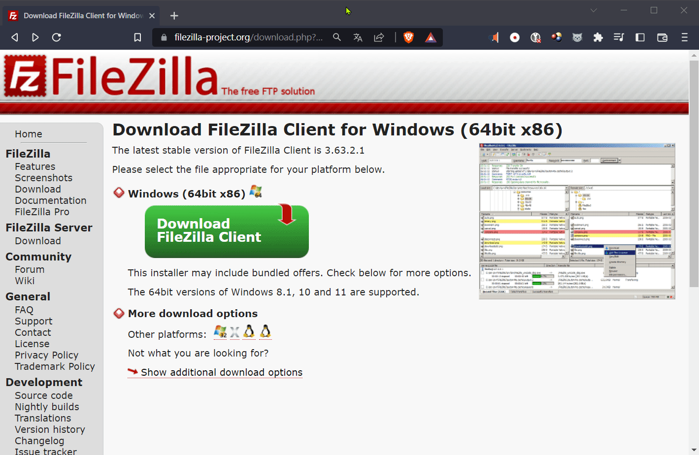
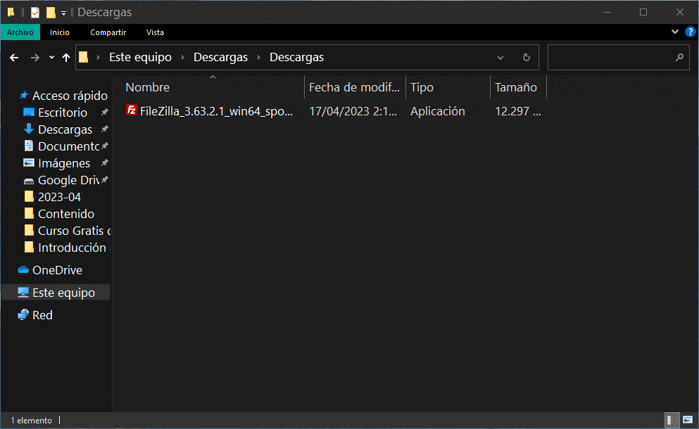

## Instalando cliente FTP en Windows
### Descargando cliente FTP
Podemos descargar FileZilla desde [aquí](https://filezilla-project.org/download.php?type=client "Descarga de FileZilla"), descargamos el archivo correspondiente al sistema operativo donde lo usaremos, para esta guía usaremos Windows como sistema operativo.

### Instalando FileZilla
Una vez descargado el archivo, procedemos a ejecutar el programa, y seguir las instrucciones de instalación. 

En caso de que ya lo tengamos instalado nos preguntara si deseamos actualizarlo, y es buena práctica mantenerlo actualizado.